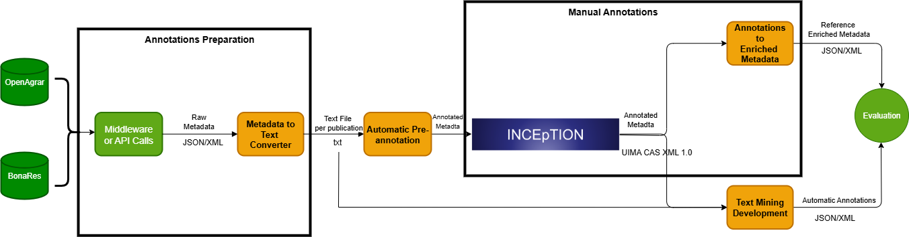

# Increasing FAIRness of FAIRagro Data Through AI-Supported Metadata Enrichment
## A FAIRagro Pilot Use Case

<p align="left">

<a href="https://huggingface.co/datasets/IT-ZBMED/Agriculture_NER_Dataset_for_FAIR_Metadata_Enrichment" target="_blank">
  
</a>

<a href="https://doi.org/10.4126/FRL01-6526458" target="_blank">
  
</a>

</p>

Funded by the [FAIRagro](https://fairagro.net/en/) consortium, the pilot use case  
**“Increasing FAIRness of FAIRagro data through AI-supported metadata enrichment”**  
develops a manually annotated agricultural text corpus to support the training and 
evaluation of **Named Entity Recognition (NER)** models.

These NER models enable automated extraction of key metadata—such as crop species, 
soil properties, geographic information, and temporal statements—from dataset 
titles and abstracts. This supports metadata enrichment at scale and contributes 
to FAIR-aligned research data practices.

This work is a collaboration between:

- **ZB MED – Information Centre for Life Sciences**  
- **Julius Kühn-Institute (JKI)**  
- **Leibniz Centre for Agricultural Landscape Research (ZALF)**  

This repository contains all code and processing pipelines used 
to construct and evaluate the NER dataset.

<figure>
  
  <figcaption>Figure 1: Overview of the use case workflow and processing pipeline.</figcaption>
</figure>

---

## Folder Structure
The repository is organized as follows:


```bash
├── code
│   ├──OpenAgrar
│   ├──corpus_creation
│   ├──pre_annotations
│   ├──generate_annotations
│   └──Bonares
├── data
│   ├──OpenAgrar
│   ├──Bonares
│   └──Corpus
├── documents
│   └──proposal.pdf
├── Toturials
├── images
├── requirements.txt
└── README.md

```
## How to use the software
Each sub-directory in the [code](https://github.com/fairagro/pilot-uc-textmining-metadata/tree/main/code) dicrectory contains the code base for the componenst it is named after. The ones named after the resources are the codes used to get the datasets from each source. The pre_annotations directory is where the code to convert the text data from the sources into the data to be used in INCEpTION software. Finally the corpus_creation includes the code used to generate the final annotated corpus. In order to use each component, please refere to the instructions inside this component.


### 1. Clone the repository

```bash
git clone https://github.com/fairagro/pilot-uc-textmining-metadata.git
cd pilot-uc-textmining-metadata
```
### 2. Create and activate a virtual environment

```bash
python3 -m venv venv
source venv/bin/activate
```
### 3. Install the dependencies

Make sure you are in the project root (where requirements.txt is located), then run:
```bash
pip install -r requirements.txt
```
## Hands-on
Please refer to the [toturials](toturials) for a showcase of how to use the dataset for models fine-tuning. It follows the token-classification toturial from Huggingface. 

## Datasets station
The [data](data) is a directory where a copy of the corpus can be accessed. It is also a helpful directory to work as an output for the different software components.

## Contributors

- [Abanoub Abdelmalak](https://github.com/AbanoubAbdelmalak)
  - Email: abdelmalak@zbmed.de
- [Gabriel Schneider](https://github.com/ga-schneider)
  - Email: schneiderg@zbmed.de
- [Murtuza Husain](https://github.com/murtuza10)
  - Email: husain@zbmed.de